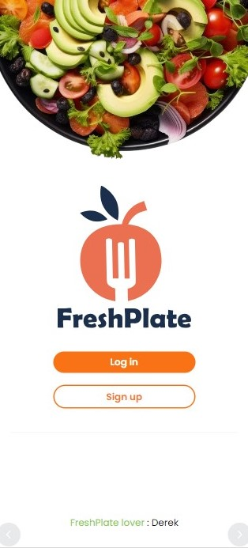
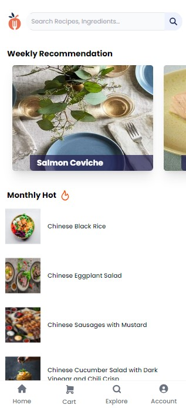
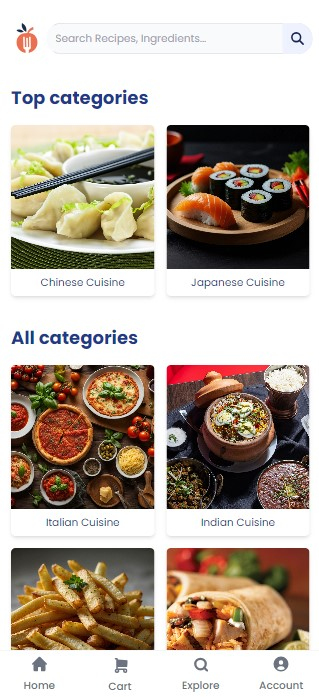
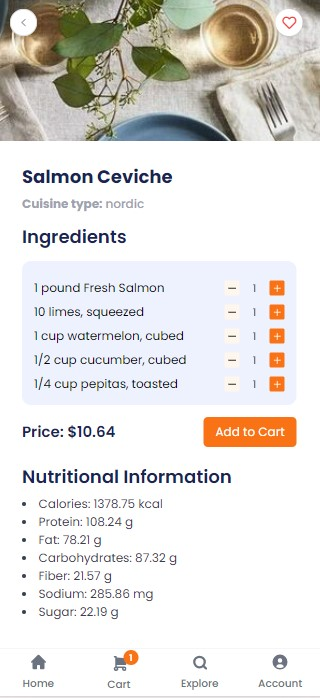

# Table of Contents

1. [FreshPlate](#freshplate)
2. [Project Title](#project-title)
3. [Project Description](#project-description)
4. [About Us](#about-us)
5. [Technologies Used](#technologies-used)
6. [Listing of File Contents](#listing-of-file-contents)
7. [How to Install or Run the Project](#how-to-install-or-run-the-project)
8. [Configuration](#configuration)
9. [How to Use the Product (Features)](#how-to-use-the-product-features)
10. [Credits, References, and Licenses](#credits-references-and-licenses)
11. [How Did You Use AI?](#how-did-you-use-ai)
12. [Contact Information](#contact-information)

---

# FreshPlate

<div style="display: flex;">
    
    
    
    
</div>

## Project Title

FreshPlate

## Project Description

FreshPlate is a web application designed to provide users with a seamless experience for discovering and managing recipes, with features such as personalized recommendations and a shopping cart for ingredients.

## About Us

**DTC-13**  
Team Members:

- Malcolm Wanless
- Xini Wang
- Caroline Su
- Flora Deng
- Joao Eduardo Santos Pollhuber

## Technologies Used

- **Frontend**: HTML, CSS, EJS (Embedded JavaScript)
- **Backend**: Node.js, Express.js
- **Database**: MongoDB
- **Other Tech Tools**: bcrypt, dotenv, express-session, joi, nodemailer, connect-mongodb-session, cors

## Listing of File Contents

```plaintext
2800-202410-DTC13
│   .env
│   .git
│   .gitignore
│   about.html
│   index.js
│   package.json
│   package-lock.json
│
├── js
│   │   caloriesCalculator.js
│   │   config.js
│   │   createFeedback.js
│   │   emailAccessToken.js
│   │   getPrice.js
│   │   getRecipeInfo.js
│   │   monthlyRecipeSchema.js
│   │   orderSchema.js
│   │   sendOrderConfirmationEmail.js
│   │   sendResetPasswordEmail.js
│   │   userSchema.js
│
├── node_modules
│
├── public
│   │   1.jpg
│   │   2.jpg
│   │   3.jpg
│   │   4.jpg
│   │   chinese_food.jpg
│   │   french_food.jpg
│   │   indian_food.jpg
│   │   italian_food.jpg
│   │   japanese_food.jpg
│   │   korean_food.jpg
│   │   landing_img.png
│   │   logo.svg
│   │   logo_with_name.svg
│   │   logo1.svg
│   │   logo2.svg
│   │   logo3.svg
│   │   logo4.svg
│   │   mexican_food.jpg
│   │   orderimg.jpg
│   │   placeholderImage.jpg
│   │   profileimg.png
│   │
│   ├── script
│   │       controlCartDisplayNumber.js
│   │       controlQuantities.js
│   │       createRecipeCard.js
│   │       errorMsg.js
│   │       favorites.js
│   │       fetchRecipes.js
│   │       filterMenu.js
│   │       filters.js
│   │       generalScript.js
│   │       getCaloriesResult.js
│   │       getLocalPreference.js
│   │       getSecurityQuestion.js
│   │       globalForRecipeSearch.js
│   │       horizontalScrollControl.js
│   │       increseCartNumber.js
│   │       initRecipeQuery.js
│   │       postPaymentAmount.js
│   │       processPayment.js
│   │       recipeInfoScript.js
│   │       removeRecipe.js
│   │       renderOrderHistory.js
│   │       setMyPrefencesFirstTime.js
│   │       toggleCalculator.js
│   │
│   └── style.css
│
└── views
    │   404.ejs
    │   browse.ejs
    │   favorites.ejs
    │   feedback.ejs
    │   home.ejs
    │   landing.ejs
    │   localPreference.ejs
    │   login.ejs
    │   logout.ejs
    │   myCart.ejs
    │   myPreference.ejs
    │   orderDetails.ejs
    │   orderConfirm.ejs
    │   payment.ejs
    │   recipeSearchPage.ejs
    │   recipeInfo.ejs
    │   resetPassword.ejs
    │   signup.ejs
    │   user_account.ejs
    │   user_profile.ejs
    │
    └── templates
        │   backBtn.ejs
        │   favoriteBtn.ejs
        │   footer.ejs
        │   header.ejs
        │   menuBar.ejs
        │   searchBar.ejs
```

## How to Install or Run the Project

### Pre-requisites:

- **Languages**: JavaScript (Node.js)
- **IDEs**: Any modern IDE or text editor (e.g., VSCode)
- **Database**: MongoDB (Atlas or local instance)
- **Other Software**: Node.js, npm
- **Browser**: Chrome, Edge, Firefox

### Installation:

1. **Clone the repository**:
   ```bash
   git clone https://github.com/yourusername/freshplate.git
   cd freshplate
   ```
2. **Install dependencies**:
   ```bash
   npm install
   ```
3. **Set up environment variables**:
   Create a `.env` file in the root directory and add the following:

   ```plaintext
   PORT=3000
   MONGODB_SESSION_SECRET=your_mongodb_session_secret
   MONGODB_USER=your_mongodb_user
   MONGODB_PASSWORD=your_mongodb_password
   MONGODB_HOST=your_mongodb_host

   EDAMAM_APP_ID=your_edamam_app_id
   EDAMAM_APP_KEY=your_edamam_app_key

   FRESHPLATE_EMAIL=your_freshplate_email
   EMAIL_CLIENTID=your_email_clientid
   EMAIL_CLIENTSECRET=your_email_clientsecret
   EMAIL_REFRESH_TOKEN=your_email_refresh_token

   NUTRITIONIX_APP_ID=your_nutritionix_app_id
   NUTRITIONIX_APP_KEY=your_nutritionix_app_key
   ```

4. **Run the application**:
   ```bash
   node .\index.js
   ```
5. **Open the local host in your browser**

### Configuration:

- Ensure MongoDB is running and accessible.
- Apply API key at Edamam for [recipe search](https://developer.edamam.com/edamam-recipe-api).
- Apply API key at Nutritionix for [natural language for exercise](https://www.nutritionix.com/business/api?creative=249135079381&keyword=restaurant%20api&matchtype=b&network=g&device=c&utm_source=google&utm_medium=cpc&utm_campaign=NutritionAPI&gad_source=1&gclid=Cj0KCQjwpNuyBhCuARIsANJqL9NebDncShpfC5AtyFsuGGAC9dnFPS6iRiCUfWp3qvGGJ8HiKyofLX8aAsZOEALw_wcB).
- Get NodeMailer setup.
  > 💡 **Tip:**
  >
  > For guidance on setting up Nodemailer for the first time, check out this helpful [YouTube video](https://www.youtube.com/watch?v=18qA61bpfUs&t=1s).
- Update environment variables with your credentials and API keys.

## How to Use the Product (Features)

- **Recipe Searching**
  - **Search for Recipes**: Users can search for recipes based on ingredients, cuisine, or dietary preferences using the integrated search functionality.
  - **Filter Results**: Use various filters to narrow down search results to find exactly what you're looking for, such as vegan, gluten-free, or low-carb recipes.
- **Recipe Details**
  - **View Detailed Recipe Information**: Click on a recipe to view detailed information, including ingredients, preparation steps, nutritional information, and an estimated total cost.
  - **Nutritional Information**: Access detailed nutritional information to ensure the recipe meets your dietary needs.
- **Shopping Cart**
  - **Add Recipes to Shopping Cart**: Add the ingredients of a selected recipe to your shopping cart for easy grocery planning.
  - **Adjust Quantities**: Adjust the quantity of ingredients based on your needs before purchasing.
- **Recipe Recommendations**

  - **Weekly Recommendations**: View weekly recommended recipes based on popular trends and user preferences.
  - **Monthly Hot Recipes**: Explore a list of monthly hot recipes that are currently trending.

- **Calories Burned for Exercise**
  - **Check Calories Burned for Exercise**: Input natural language to specify the types of exercises users performed and their durations, in order to calculate the calories burned for reference.
- **Edit Preference List**

  - **Add or Remove Preferences**: Input preference keywords to add or remove from the user's preference list. This action enables users to update their preferences, thereby receiving new weekly recommendations tailored to their preferences.

- **Favorite Recipes**

  - **Add recipes into Favorite list**: Add specific recipes to their favorite list by clicking the heart icon located in the upper right corner of the recipe information page. This allows users to conveniently access their favorite recipes directly from the favorite list in the user account.
  - **Add recipes into Favorite list**: Remove specific recipes from favorite list by clicking the heart icon located in the upper right corner of My Favorites page.

- **Edit Profile**

  - **Edit User Profile**: Edit the user's phone number and address by clicking on the `Edit` button located in the upper right corner of the user account page.

- **Feeback**

  - **Provide Feedback**: Users can submit their feedback, which will be displayed on the landing page for reference by potential users.

- **Password**

  - **Reset Password**: Users can reset their password by providing the correct security answer they set. Upon successful submission, they will receive an email confirming the password change.

- **Payment**
  - **Process Payment**: Users can proceed with payment by checking out recipes in the My Cart page. Upon completion, users will receive an email confirmation for their order.

## Credits, References, and Licenses

- **Credits**: Developed by DTC 13
- **References**:
  - Edamam API for recipe data
  - Nutritionix API for natural language for exercise
  - MongoDB for database management
  - Various npm packages for backend functionality
- **License**: ISC

## How Did You Use AI?

**Did we use AI to help create our app?**

- Used AI to refine and troubleshoot code snippets, especially for integrating third-party APIs and handling user authentication.
- The app does not directly use AI for its primary functions but uses AI recommendations for refactoring and efficiency.

**Did you use AI to create data sets or clean data sets?**

- FreshPlate does not utilize AI for data processing. All data used by FreshPlate either originates from APIs or is generated by developers.

**Does your app use AI?**

- FreshPlate does not incorporate AI into its operations. However, we do retrieve data from APIs.

**Did you encounter any limitations? What were they, and how did you overcome them?**

- We do not believe that we encountered any limitations. As we were just using AI for reference, there were no AI integration issues.

## Contact Information

**Email**:  
Xinli Wang : shirley.wang.xl@outlook.com  
Malcolm Wanless: mwanless2@my.bcit.ca  
Flora Deng : hdeng24@my.bcit.ca  
Caroline Su : jsu62@my.bcit.ca  
Joao Eduardo Santos Pollhuber: jpollhuber@outlook.com
